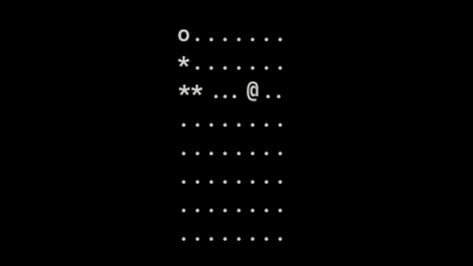

# Snake Game AI

This is my project for the 24th MMU Hackerspace Hackathon. The goal is to train a neural network to play snake game using RL (Reinforcement Learning) with [Deep Q Learning](https://en.wikipedia.org/wiki/Q-learning#Deep_Q-learning) in [PyTorch](https://pytorch.org/). 

    

This snake game is playing on a 8x8 grid, because I didn't have much time to train for a 20x20 board. Feel free to change `self.N` parameter in the `environment.py` and retrain it.

If you'd like, you can run `main.py` for a snake game simulation with the trained agent.

## Approach

[Here](model.ipynb)